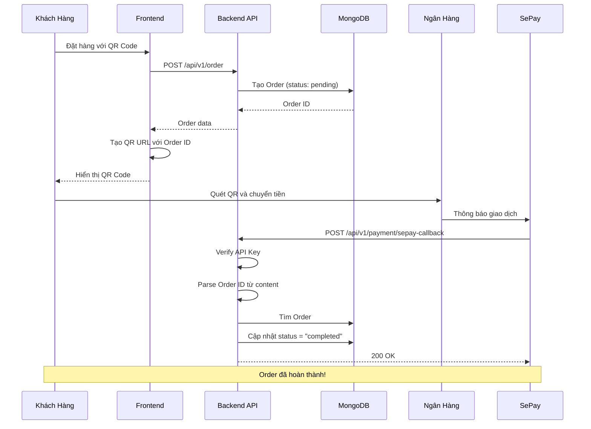

# Hướng Dẫn Cấu Hình Webhook SePay

## Tổng Quan

Webhook SePay cho phép hệ thống của bạn nhận thông báo tự động khi có giao dịch chuyển khoản thành công. Khi khách hàng quét mã QR và chuyển tiền, SePay sẽ gửi request đến webhook URL của bạn để cập nhật trạng thái đơn hàng.

## Yêu Cầu

- ✅ Tài khoản SePay đã được kích hoạt
- ✅ API Key: `spsk_live_N2b1WtqgwRuL2BAQsoMYR5UP9KLRGpm`
- ✅ Merchant ID: `SP-LIVE-DDB47656`
- ✅ Tài khoản ngân hàng: `VQRQAFQTK9276` (MBBank)

## Bước 1: Cấu Hình Webhook URL trên SePay Dashboard

### Option A: Sử dụng Production Server (Khuyến nghị)

1. **Deploy backend lên server**
   - VPS/Cloud server với domain/IP public
   - Hoặc deploy lên Vercel/Railway/Render

2. **Đăng nhập SePay Dashboard**
   - Truy cập: https://my.sepay.vn
   - Đăng nhập với tài khoản của bạn

3. **Cấu hình Webhook**
   - Vào menu **Cài đặt** → **Webhook**
   - Nhập Webhook URL: `https://your-domain.com/api/v1/payment/sepay-callback`
   - Lưu cấu hình

### Option B: Test với Ngrok (Development)

Nếu bạn đang test local, cần expose localhost ra internet:

```bash
# Cài đặt ngrok (nếu chưa có)
# Download tại: https://ngrok.com/download

# Chạy backend trước
cd d:\webbanhang\web\ecom\ecom\api-ecomerse-raw
npm start

# Trong terminal khác, chạy ngrok
ngrok http 3000
```

Ngrok sẽ tạo URL public, ví dụ: `https://abc123.ngrok.io`

**Cấu hình trên SePay:**
- Webhook URL: `https://abc123.ngrok.io/api/v1/payment/sepay-callback`

> ⚠️ **Lưu ý:** Ngrok URL thay đổi mỗi lần restart. Bạn cần cập nhật lại webhook URL trên SePay mỗi lần chạy ngrok mới.

## Bước 2: Kiểm Tra Cấu Hình

### 2.1. Verify Environment Variables

File `.env` đã được cấu hình:

```env
SEPAY_API_KEY=spsk_live_N2b1WtqgwRuL2BAQsoMYR5UP9KLRGpm
Merchant_ID=SP-LIVE-DDB47656
```

### 2.2. Verify Backend Running

```bash
cd d:\webbanhang\web\ecom\ecom\api-ecomerse-raw
npm start
```

Server phải chạy ở port 3000. Check console log:
```
Server is running on port 3000
MongoDB connected successfully
```

## Bước 3: Test Webhook

### Test 1: Sử dụng test-webhook.js

```bash
# Terminal 1: Chạy backend
cd d:\webbanhang\web\ecom\ecom\api-ecomerse-raw
npm start

# Terminal 2: Tạo đơn hàng test
# 1. Mở browser: http://localhost:5173
# 2. Thêm sản phẩm vào giỏ hàng
# 3. Checkout và chọn phương thức "QR CODE"
# 4. Click "PLACE ORDER"
# 5. Lưu lại Order ID (check MongoDB hoặc console log)

# Terminal 3: Test webhook
cd d:\webbanhang\web\ecom\ecom\api-ecomerse-raw
# Mở file test-webhook.js, thay YOUR_ORDER_ID bằng order ID thật
node test-webhook.js
```

**Kết quả mong đợi:**

```
🚀 Sending webhook test...
📦 Order ID: 674d8e9f1234567890abcdef
💰 Amount: 1000000 VND

✅ Webhook test successful!
📄 Response: {
  "success": true,
  "message": "Payment processed successfully",
  "data": {
    "orderId": "674d8e9f1234567890abcdef",
    "status": "completed",
    "transactionId": 92704
  }
}
```

### Test 2: Kiểm Tra Database

Mở MongoDB Compass và check order:

```javascript
// Order status phải chuyển từ "pending" → "completed"
{
  _id: "674d8e9f1234567890abcdef",
  status: "completed",  // ✅ Đã cập nhật
  paymentInfo: {
    sepayTransactionId: 92704,
    gateway: "MBBank",
    transferAmount: 1000000,
    paidAt: "2025-12-09T12:30:00.000Z"
  }
}
```

### Test 3: End-to-End với SePay Thật

> ⚠️ **Chỉ test sau khi đã cấu hình webhook URL trên SePay dashboard**

1. **Tạo đơn hàng:**
   - Mở frontend: http://localhost:5173
   - Thêm sản phẩm vào giỏ hàng
   - Chọn "QR CODE" và đặt hàng
   - Lưu lại Order ID

2. **Quét QR và chuyển tiền:**
   - Quét mã QR hiển thị trên màn hình
   - Chuyển tiền qua app ngân hàng
   - **Quan trọng:** Nội dung chuyển khoản phải có format: `ORDER_<order_id>`

3. **Kiểm tra webhook:**
   - Check console log backend xem có nhận webhook callback không
   - Check MongoDB xem order status đã chuyển thành "completed" chưa

## Cấu Trúc Webhook Request

SePay sẽ gửi POST request với format:

```json
{
  "id": 92704,
  "gateway": "MBBank",
  "transactionDate": "2025-12-09 18:30:00",
  "accountNumber": "VQRQAFQTK9276",
  "code": null,
  "content": "ORDER_674d8e9f1234567890abcdef",
  "transferType": "in",
  "transferAmount": 1000000,
  "accumulated": 5000000,
  "subAccount": null,
  "referenceCode": "MBVCB.3278907687",
  "description": "Thanh toan don hang"
}
```

**Headers:**
```
Authorization: Apikey spsk_live_N2b1WtqgwRuL2BAQsoMYR5UP9KLRGpm
Content-Type: application/json
```

## Flow Hoạt Động



## Troubleshooting

### Lỗi 401 Unauthorized

**Nguyên nhân:** API key không đúng hoặc thiếu

**Giải pháp:**
```bash
# Kiểm tra file .env
cat d:\webbanhang\web\ecom\ecom\api-ecomerse-raw\.env | grep SEPAY_API_KEY

# Phải có dòng:
SEPAY_API_KEY=spsk_live_N2b1WtqgwRuL2BAQsoMYR5UP9KLRGpm
```

### Order không tìm thấy

**Nguyên nhân:** Content chuyển khoản không đúng format

**Giải pháp:**
- Đảm bảo QR URL có format: `des=ORDER_<order_id>`
- Kiểm tra frontend RightBody.jsx line 86
- Content phải match regex: `/ORDER[_\s]?([a-zA-Z0-9\-]+)/i`

### Webhook không được gọi

**Nguyên nhân:** 
- Webhook URL chưa cấu hình trên SePay
- Backend không accessible từ internet

**Giải pháp:**
1. Kiểm tra webhook URL trên SePay dashboard
2. Test với curl:
   ```bash
   curl -X POST https://your-domain.com/api/v1/payment/sepay-callback \
     -H "Authorization: Apikey spsk_live_N2b1WtqgwRuL2BAQsoMYR5UP9KLRGpm" \
     -H "Content-Type: application/json" \
     -d '{"id":1,"gateway":"MBBank","transferType":"in","transferAmount":100000,"content":"ORDER_test"}'
   ```

### Số tiền không khớp

**Nguyên nhân:** Khách hàng chuyển thiếu tiền

**Kết quả:** Webhook vẫn nhận nhưng không cập nhật order status

**Log:**
```
Payment amount insufficient: {
  received: 500000,
  required: 1000000,
  orderId: '674d8e9f1234567890abcdef'
}
```

## Bảo Mật

1. **Không commit API key lên Git:**
   ```bash
   # File .env đã có trong .gitignore
   # Kiểm tra:
   git status
   # .env không được hiển thị trong untracked files
   ```

2. **Sử dụng HTTPS cho production:**
   - Webhook URL phải dùng HTTPS
   - Cài đặt SSL certificate (Let's Encrypt miễn phí)

3. **Validate API key:**
   - Backend đã có middleware kiểm tra API key
   - Reject request nếu API key không đúng

## Monitoring & Logging

Backend đã có logging cho mọi webhook callback:

```javascript
// Check logs
console.log('SePay Callback received:', {...})
console.log('Order payment processed successfully:', {...})
```

**Khuyến nghị:** Sử dụng logging service như:
- Winston + MongoDB
- Sentry cho error tracking
- LogRocket cho session replay

## Liên Hệ Hỗ Trợ

- **SePay Support:** https://sepay.vn/lien-he
- **Documentation:** https://docs.sepay.vn
- **Hotline:** (Kiểm tra trên website SePay)
